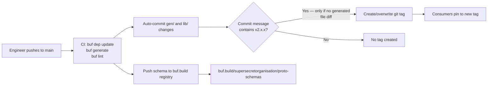
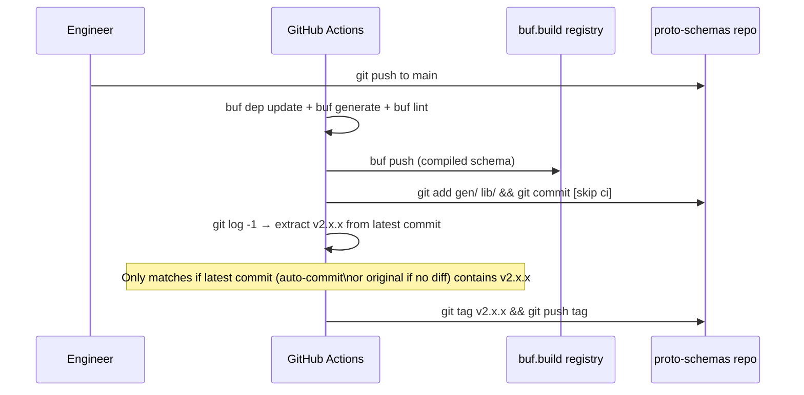

# Architecture — proto-schemas

arc42-light. Last verified against code 2026-07-20.

## 1. Context

`proto-schemas` is the central contract repository for all gRPC interfaces in the Feat platform. It defines, versions, and distributes every protobuf service contract used by the Go backend (`server`), Flutter mobile client (`app`), and messaging service (`messaging-server`).

External actors:
- **server** — Go gRPC backend; imports generated Go stubs via `go get github.com/supersecretorganisation/proto-schemas/v2@<tag>`.
- **app** — Flutter client; imports generated Dart stubs via `pubspec.yaml` git dependency pinned to a tag.
- **messaging-server** — Go service; imports Go stubs.
- **buf.build registry** — remote compiled schema store pushed on every `main` push.

## 2. Constraints

- **Buf v2 toolchain**: generation is fully managed by Buf; `protoc` is not used directly.
- **Generated files committed**: `gen/` (Go stubs) and `lib/` (Dart stubs) are committed to the repo by CI bot after each `buf generate` run. Do not edit them manually.
- **Breaking changes require coordinated release**: any field removal or incompatible type change must be coordinated across all consumer repos before tagging.
- **Tag mutability**: CI deletes and recreates tags rather than failing on existing ones — no immutable-tag guarantee. See `docs/how-to/release-a-version.md` for the known limitation with schema-change pushes.

## 3. Building blocks

| Path | Responsibility |
|---|---|
| `proto/<domain>/v1/<domain>.proto` | Service and message definitions; one file per domain |
| `gen/go/proto/<domain>/v1/` | Generated Go gRPC stubs (committed by CI) |
| `lib/gen/dart/<domain>/v1/` | Generated Dart gRPC stubs (committed by CI) |
| `buf.yaml` | Buf v2 config: lint rules (STANDARD), breaking-change detection |
| `buf.gen.yaml` | Generation targets: Go (`protoc-gen-go`, `protoc-gen-go-grpc`) and Dart (`protoc-gen-dart`) |
| `.github/workflows/generate_files.yaml` | CI: generate → lint → push to buf.build → auto-commit → optional tag |

## 4. Runtime view — CI flow

## 5. Deployment

- **Schema registry**: `buf.build/supersecretorganisation/proto-schemas` — pushed on every `main` push; requires `BUF_TOKEN` Actions secret.
- **Consumer pinning**: consumers reference a specific git tag (`v2.x.x`) or the repo URL directly. Current pins: server `v2.6.1`, app `v2.5.4`, messaging-server `v2.4.1`.
- **CI runner**: `ubuntu-latest` via `bufbuild/buf-action@v1`.

## 6. Cross-repo dependencies

| Consumer | Language | Pin mechanism |
|---|---|---|
| `SuperSecretOrganisation/server` | Go | `go.mod` — `github.com/supersecretorganisation/proto-schemas/v2 v2.6.1` |
| `SuperSecretOrganisation/app` | Dart | `pubspec.yaml` git dep — `ref: v2.5.4` |
| `SuperSecretOrganisation/messaging-server` | Go | `go.mod` — `v2.4.1` |

## 7. Known issues & technical debt

- **Version tagging unreliable for schema-change pushes**: `COMMIT_MSG=$(git log -1 --pretty=%B)` runs after the auto-commit step, so for any push that changes `.proto` files the latest commit is `chore: auto-generate proto files [skip ci]` and no tag is created. See `docs/how-to/release-a-version.md` for details and the workaround.
- **Tags are mutable**: CI deletes and recreates existing tags. There is no immutable release guarantee.
- **Version skew between consumers**: server is on `v2.6.1`, app on `v2.5.4`. Fields added between those tags are invisible to the Flutter client until the app pin is updated.
- **18 services, 3 distinct consumer versions**: coordinating breaking changes across all consumers requires manual version-bump PRs in each repo.
